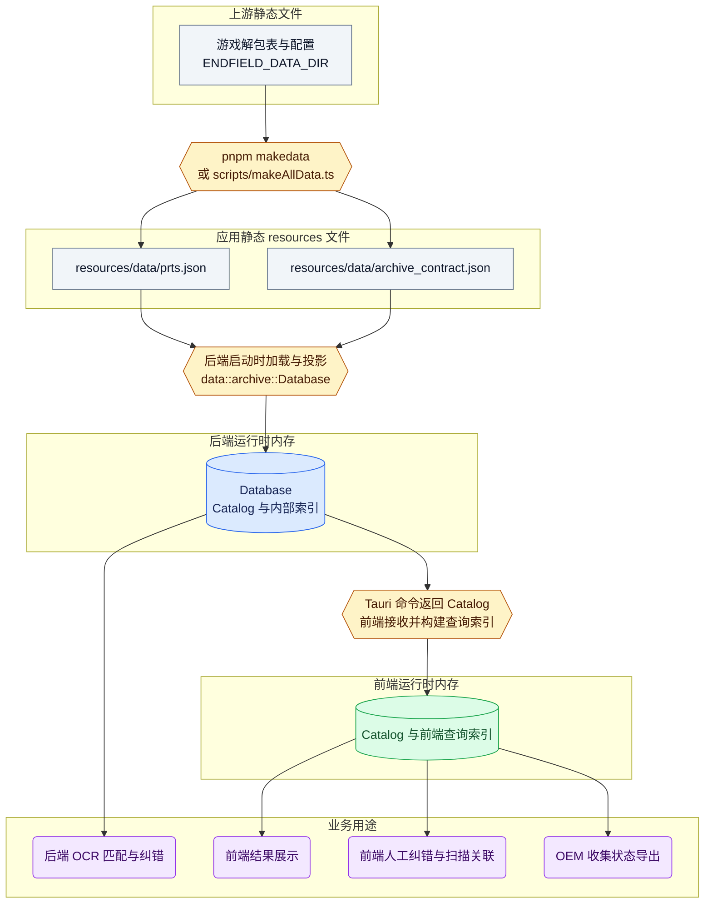
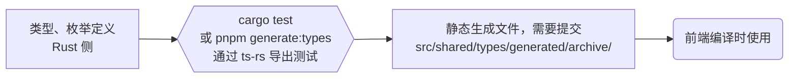

# 数据与共享类型管线

档案数据经过解包、`resources` 生成、后端投影后供业务使用。Rust 到 TypeScript 的类型生成是独立的开发流程。相关类型定义位置见下文。

- 从解包数据到 `resources` 文件：由 `scripts/` 脚本负责。会影响安装包体积。
- 从 `resources` 文件到后端内存：后端单独维护一份 `resources` 的文件 schema，然后投影为后端内存中经过类型检查的数据类型。
- 从后端到前端：主要通过 tauri IPC 传输。`ts-rs` 为这些传输接口提供了统一的 schema 转换，从而避免维护两份类型、枚举等定义。

相关 schema 和类型定义位置：

- 解包数据 schema 定义：[scripts/models/tableCfg/](../scripts/models/tableCfg/)、[scripts/models/json/](../scripts/models/json/)（TS）
- `resources` 文件 schema 定义：生成侧 [scripts/models/resources/](../scripts/models/resources/)（TS），接收侧 [archive/source.rs](../src-tauri/src/data/archive/source.rs)（Rust，只声明读取所需字段）
- 后端数据类型与生成的前端数据类型：[archive/model.rs](../src-tauri/src/data/archive/model.rs)（Rust）、[src/shared/types/generated/archive/](../src/shared/types/generated/archive/)（TS）

前端通过 [src/shared/types/archive.ts](../src/shared/types/archive.ts) 的手写 barrel 导入档案类型，生成文件单独放在 `generated/` 下。

解包数据的输入、资源生成命令及档案标题来源见 [解包数据参考](game-data.md)。

## 档案数据流

图中矩形表示静态文件，六边形表示命令或转换逻辑，圆柱表示运行时内存数据，圆角节点表示业务用途。

## 类型生成流

部分前端、后端共用的类型通过 `ts-rs` 统一从 rust 类型编译为 ts 类型。这些生成的文件进入 Git 版本管理。

运行 `cargo test` 命令时，ts-rs 导出测试将会运行，以副作用直接更新生成文件。[package.json](../package.json) 中的 `pnpm generate:types` 直接调用 `cargo test --lib export_bindings`，可以单独运行这些导出测试。默认输出的根目录位置目前由 [.cargo/config.toml](../.cargo/config.toml) 指定。

## 增加其他数据领域

新增数据领域时，可以沿用 `resource` 生成、后端从 `resource` 投影、定义并生成前端契约的流程，分别拥有自己的 namespace 和生成文件目录。
