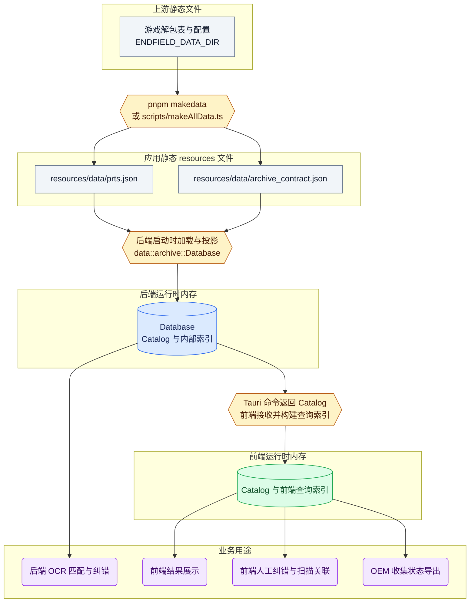
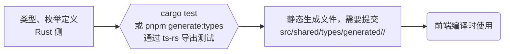

# 数据与共享类型管线

档案数据经过解包、`resources` 生成、后端投影后供业务使用。Rust 到 TypeScript 的类型生成是独立的开发流程。相关类型定义位置见下文。

- 从解包数据到 `resources` 文件：由 `scripts/` 脚本负责。会影响安装包体积。
- 从 `resources` 文件到后端内存：后端单独维护一份 `resources` 的文件 schema，然后投影为后端内存中经过类型检查的数据类型。
- 从后端到前端：主要通过 Tauri IPC 传输。命令参数、返回值、事件和 Channel 的共享数据类型由 `ts-rs` 从 Rust 生成 TypeScript 类型，维护规则见下文。

相关 schema 和类型定义位置：

- 解包数据 schema 定义：[scripts/models/tableCfg/](../scripts/models/tableCfg/)、[scripts/models/json/](../scripts/models/json/)（TS）
- `resources` 文件 schema 定义：生成侧 [scripts/models/resources/](../scripts/models/resources/)（TS），接收侧 [archive/source.rs](../src-tauri/src/data/archive/source.rs)（Rust，只声明读取所需字段）
- 后端数据类型与生成的前端数据类型：[archive/model.rs](../src-tauri/src/data/archive/model.rs)（Rust）、[src/shared/types/generated/archive/](../src/shared/types/generated/archive/)（TS）

前端通过 [src/shared/types/archive.ts](../src/shared/types/archive.ts) 的手写 barrel 导入档案类型，生成文件单独放在 `generated/` 下。

解包数据的输入、资源生成命令及档案标题来源见 [解包数据参考](game-data.md)。

## 档案数据流

图中矩形表示静态文件，六边形表示命令或转换逻辑，圆柱表示运行时内存数据，圆角节点表示业务用途。



## 类型生成流

前后端共用的数据类型统一由 `ts-rs` 从 Rust 类型生成 TypeScript 类型。这些生成的文件进入 Git 版本管理。



运行 `cargo test` 命令时，ts-rs 导出测试将会运行，以副作用直接更新生成文件。[package.json](../package.json) 中的 `pnpm generate:types` 直接调用 `cargo test --lib export_bindings`，可以单独运行这些导出测试。默认输出的根目录位置目前由 [.cargo/config.toml](../.cargo/config.toml) 指定。

## ts-rs 编写与管理约定

### Rust 定义与目录

共享类型直接写在对应的 Rust 领域模块里。
统一使用 `use ts_rs::TS;` 导入，然后为类型及其嵌套依赖加上 `TS` derive。使用 `export_to` 指定导出到哪个领域目录。例如：

```rust
use serde::Serialize;
use ts_rs::TS;

#[derive(Serialize, TS)]
#[serde(rename_all = "camelCase")]
#[ts(export, export_to = "automation/")]
pub struct ExampleStatus {
    pub task_name: String,
    pub last_error: Option<String>,
}
```

生成根目录由 [.cargo/config.toml](../.cargo/config.toml) 里的 `TS_RS_EXPORT_DIR` 指定。`export_to` 填写以 `/` 结尾的领域目录，最终路径将会相对于该根目录。引用其他领域的类型时直接复用原类型，生成器会自行处理 import。

### 序列化契约

新增共享类型不使用 serde 的 `content`。

Tagged union 生成 TypeScript 时可能丢失分支或字段的注释；需要保留的说明写在 Rust 类型顶部的文档注释中。

注意整数类型的映射：ts-rs 默认把 `u64` 等类型生成为 `bigint`，而它们经 JSON 传输后在前端实际是普通数字，两种表示并不一致。可以用 `#[ts(type = "number")]` 之类的字段属性覆盖生成类型。选择哪种表示要结合业务取值范围、精度需求和序列化方式，并留意 JavaScript 的安全整数范围。

### TS 文件组织

生成文件位于 `src/shared/types/generated/<domain>/`，需要提交到 Git，不要手工修改。再由 `src/shared/types/<domain>.ts` 手写 barrel 重导出，业务代码和 feature 的 `ipc.ts` 通过 `import type` 从 barrel 导入。

### 生成与验证

1. 修改 Rust 定义及其 serde / ts-rs 属性，运行 `pnpm generate:types`。
2. 检查生成的 diff，重点核对字段名、tag、null、optional、整数映射和跨领域 import。删除、重命名或移动类型后要手动删除旧的生成文件并更新 barrel，导出过程不会自动清理。
3. 运行 `pnpm build` 和 `pnpm check` 验证前端使用方，同时完成 [后端检查](rule-backend.md#编译检查与测试)。导出需要编译并执行 Rust 测试，以 Windows 环境为准；macOS 上可用 `cargo xwin clippy` 检查 Windows 编译，但无法执行导出测试。
4. 把 Rust 定义、生成文件、barrel 和相关的调用方改动一起提交。升级 ts-rs 时同样要重新生成并审阅输出。

[CI](../.github/workflows/ci.yml) 会在 Windows 上运行后端测试，然后检查 `src/shared/types/generated/` 下是否有未提交的变更。新增类型只要带上 `#[ts(export)]` 就会纳入这项检查，不需要再额外写测试去镜像这些字段定义。

## 增加其他数据领域

新增数据领域时，可以沿用 `resource` 生成、后端从 `resource` 投影、定义并生成前端契约的流程，分别拥有自己的 namespace 和生成文件目录。

## 自动化契约归属

`automation` 拥有任务生命周期、`WorkerType` 和线程启动失败事实。
游戏会话拥有可复用的环境与捕获失败事实，具体任务负责将其转换成通用的 `automation::Error::Worker` 原因。
`automation::archive_scan` 拥有档案扫描结果、扫描顺序和中文标题纠正规则。
命令与事件使用所属领域的错误类型，不增加跨领域的统一错误包装。
`UiLocale` 和 `GameLocale` 是共享语言类型，系统默认应用语言由设置模块通过平台能力选择。
